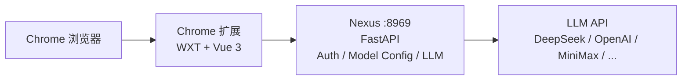

<div align="center">
  
  <h1>FastFlow</h1>
  <p>AI 工作流 Copilot — 页面内嵌聊天框，支持多模型、流式对话、工作流感知</p>
  <p>
    <a href="https://developer.chrome.com/docs/extensions/develop/migrate/what-is-mv3">
      
    </a>
    <a href="https://vuejs.org">
      
    </a>
    <a href="https://fastapi.tiangolo.com">
      
    </a>
    <a href="https://docs.litellm.ai">
      
    </a>
    
    
  </p>
</div>

## 项目简介

FastFlow 是一个 AI 工作流 Copilot，由两部分组成：

- **Chrome 扩展**（WXT + Vue 3）：注入到任意网页中的聊天框，支持悬浮气泡、可拖拽面板、多模型切换、Slash 协议编排。
- **Nexus 服务**（FastAPI，单进程，端口 8969）：统一处理认证、模型配置、LLM 调用、SSE 流式输出。

已从原三段式架构精简为**两段式**（Extension + Nexus），去掉 Java / Spring Boot / PostgreSQL 依赖。模型和用户配置存于 JSON 文件，修改即生效，零外部数据库。

## 架构总览



**一个进程，一个端口**：Nexus 在 8969 端口同时提供认证、模型 CRUD、智能体对话、Slash 面板等全部能力。扩展通过 Shadow DOM 隔离注入页面，所有后端请求统一走 background service worker，屏蔽跨域和宿主隔离问题。

## 核心功能

### 聊天交互
- 悬浮气泡开关，任意网页一键唤出
- 可拖拽调整位置，四角拖拽调整面板尺寸
- 流式 SSE 响应（打字机效果）
- 自动跟随最新消息滚动
- 消息复制、Mermaid 图表放大预览（支持平移/缩放）
- 中途停止生成

### 模型管理
- 模型下拉选择，切换即时生效
- **添加私有模型**：支持配置名称、Model ID、Provider、API Key、Base URL
- **编辑私有模型**：悬停下拉项显示编辑按钮，复用添加弹窗
- **删除私有模型**：悬停显示删除按钮
- 每用户最多 2 个私有模型（公共模型不限）
- Provider 选择时自动填充默认 Base URL
- Base URL 校验（防止 API Key 误填入 URL）

### 协议编排（Protocol Composer）
- 输入 `/` 触发技能面板，选择并插入技能引用
- 输入 `#` 触发节点面板，选择并插入工作流节点引用
- 消息中技能/节点以可视化 Chip 展示
- 键盘导航（↑↓ Enter Esc Tab）

### 智能体模式
| 模式 | 图标 | 说明 |
|------|------|------|
| Deep Chat | 💬 | 通用 AI 对话，需选择模型 |
| SOLO Builder | 🤖 | 工作流自动生成（规划中） |
| SOLO Debugger | 🐛 | 工作流智能排错（规划中） |

### 主题与设置
- 深色 / 浅色 / 跟随系统 三种主题
- Mermaid 图表随主题自动切换配色
- Popup 设置面板：主题切换、服务地址配置、版本信息
- 登录 / 注册（支持邀请码）

## 支持的 LLM Provider

| Provider | 默认 Base URL | LiteLLM Provider | 备注 |
|----------|--------------|------------------|------|
| OpenAI | `https://api.openai.com/v1` | openai | — |
| Anthropic | `https://api.anthropic.com` | anthropic | — |
| DeepSeek | `https://api.deepseek.com` | deepseek | - |
| MiniMax | `https://api.minimaxi.com/v1` | openai | OpenAI 兼容模式 |
| Qwen (通义千问) | `https://dashscope.aliyuncs.com/compatible-mode/v1` | — | — |
| GLM (智谱) | `https://open.bigmodel.cn/api/paas/v4` | — | — |
| Moonshot | `https://api.moonshot.cn/v1` | — | — |
| Other | 自定义 | — | 手动输入 URL |


## 快速开始

### 环境要求

- **Python 3.10+**
- **Node.js 18+**（仅构建扩展时需要）
- **Google Chrome**（支持 Manifest V3）
- 零外部数据库依赖

### 1. 启动 Nexus 服务

**一键启动（推荐）：**

```bash
./start-nexus.sh
```

脚本自动完成：Python 版本检查 → 虚拟环境创建 → 依赖安装 → PYTHONPATH 设置 → 启动服务。

**常用命令：**

| 命令 | 说明 |
|------|------|
| `./start-nexus.sh` | 前台启动（默认，Ctrl+C 停止） |
| `./start-nexus.sh --daemon` | 后台启动 |
| `./start-nexus.sh --stop` | 停止后台服务 |
| `./start-nexus.sh --restart` | 重启后台服务 |
| `./start-nexus.sh --help` | 查看帮助 |

**从 nexus 目录运行：**

```bash
cd nexus
./start.sh
```

默认监听：`http://0.0.0.0:8969`

验证启动成功：
```bash
curl http://localhost:8969/fastflow/nexus/v1/health
# {"code":200,"data":{"status":"Online","service":"FastFlow-Nexus","version":"1.1.0"}}
```

<details>
<summary>手动启动（不用脚本）</summary>

```bash
cd nexus
python3 -m venv .venv
source .venv/bin/activate
pip install -r requirements.txt
cd /home/tdq/fastflow
PYTHONPATH=/home/tdq/fastflow python -m nexus.main
```

</details>

### 2. 构建 Chrome 扩展

```bash
cd chrome-extension
npm install
npm run build:dev
```

产物目录：`chrome-extension/dist/development/`

### 3. 加载扩展

1. 打开 Chrome，访问 `chrome://extensions`
2. 开启右上角「开发者模式」
3. 点击「加载已解压的扩展程序」
4. 选择 `chrome-extension/dist/development/`

### 4. 配置扩展连接地址

新建 `chrome-extension/.env.development.local`：

```bash
WXT_API_BASE_URL=http://127.0.0.1:8969
WXT_NEXUS_BASE_URL=http://127.0.0.1:8969
```

> 如果 Nexus 和 Chrome 不在同一台机器（如 WSL + Windows），将 `127.0.0.1` 换成 Nexus 宿主机的 IP。

### 5. 生成邀请码并注册账号

Nexus 部署后需要先生成邀请码，用户凭邀请码注册：

```bash
cd /home/tdq/fastflow
source nexus/.venv/bin/activate
PYTHONPATH=/home/tdq/fastflow python3 nexus/scripts/generate_invite_codes.py --count 10
# 输出示例：
#   V4E0ZP
#   YGC8AY
#   ...
```

1. 点击扩展图标 → 注册账号，填写邀请码
2. 登录后，在聊天框底部模型下拉菜单中点击「Add Model」
3. 填写模型信息（Provider 选择后 Base URL 自动填充）
4. 保存后在模型下拉中切换即可使用

## 服务配置

### Nexus 环境变量 (`nexus/.env`)

| 变量 | 默认值 | 说明 |
|------|--------|------|
| `APP_HOST` | `0.0.0.0` | 监听地址 |
| `APP_PORT` | `8969` | 监听端口 |
| `APP_VERSION` | `1.1.1` | 服务版本号 |
| `LOG_LEVEL` | `INFO` | 日志级别 |
| `LOG_FILE_PATH` | `logs/engine.log` | 日志文件路径 |
| `SESSION_HISTORY_MAX_TURNS` | `10` | 单会话最大对话轮数 |
| `SESSION_HISTORY_EXPIRE_SECONDS` | `3600` | 会话过期时间（秒，≤0 永不过期） |
| `TOOL_MAX_CALLS_PER_QUESTION` | `50` | 单次提问最大工具调用次数 |
| `MODEL_STREAM_TOTAL_TIMEOUT_SECONDS` | `420` | 单轮流式总超时（秒） |

### 模型配置 (`nexus/config/models.json`)

```json
[
  {
    "id": 10001,
    "model_name": "DeepSeek Chat",
    "model_id": "deepseek-chat",
    "provider": "deepseek",
    "api_key": "sk-your-api-key",
    "base_url": "https://api.deepseek.com/v1",
    "model_params": {},
    "enabled": true,
    "user_id": null
  }
]
```

| 字段 | 说明 |
|------|------|
| `id` | 唯一标识（自动递增） |
| `model_name` | 显示名称 |
| `model_id` | API 调用时的 model 参数 |
| `provider` | LiteLLM provider 名称 |
| `api_key` | API 密钥 |
| `base_url` | API 地址 |
| `model_params` | 额外模型参数。DeepSeek 模型如需启用思考模式，设置 `"enable_thinking": true`（注意：启用后多轮对话中会自动保留推理上下文） |
| `enabled` | 是否启用 |
| `user_id` | `null` = 公共模型，数字 = 私有模型归属用户 |

> 模型配置可通过扩展 UI 管理，也可直接编辑 JSON。直接编辑后运行以下命令使其生效（无需重启服务）：
> ```bash
> source nexus/.venv/bin/activate
> PYTHONPATH=/home/tdq/fastflow python3 nexus/scripts/reload_models.py
> ```

### 用户管理 (`nexus/config/users.json`)

用户凭邀请码通过扩展注册页面注册，密码使用 bcrypt 加密存储。

### 邀请码管理 (`nexus/config/invite_codes.json`)

邀请码为一次性使用，注册后自动标记为已用。

```bash
# 生成新邀请码
source nexus/.venv/bin/activate
PYTHONPATH=/home/tdq/fastflow python3 nexus/scripts/generate_invite_codes.py --count 10

# 查看当前邀请码状态
cat nexus/config/invite_codes.json
```

邀请码格式：
```json
[{"code": "V4E0ZP", "used": false, "used_by": null, "created_at": "...", "used_at": null}]
```

### 管理脚本

| 脚本 | 说明 |
|------|------|
| `nexus/scripts/generate_invite_codes.py` | 生成一次性邀请码 |
| `nexus/scripts/reload_models.py` | 手动编辑 models.json 后清空缓存使其生效 |

## API 接口

### Nexus 智能体接口（8969 端口）

| 接口 | 方法 | 说明 |
|------|------|------|
| `/fastflow/nexus/v1/health` | GET | 健康检查 |
| `/fastflow/nexus/v1/agent/chat/completions` | POST | 智能体流式对话（SSE） |
| `/fastflow/nexus/v1/agent/chat/cancel` | POST | 取消正在运行的请求 |
| `/fastflow/nexus/v1/slash/catalog` | GET | Slash 面板技能目录 |

### API 兼容接口（8969 端口，替代原 Java API）

| 接口 | 方法 | 说明 |
|------|------|------|
| `/fastflow/api/v1/auth/login` | POST | 登录 |
| `/fastflow/api/v1/auth/register` | POST | 注册 |
| `/fastflow/api/v1/auth/checkLogin` | POST | 检查登录状态 |
| `/fastflow/api/v1/model_config/list` | GET | 模型列表 |
| `/fastflow/api/v1/model_config` | POST | 添加模型 |
| `/fastflow/api/v1/model_config/{id}` | GET | 模型详情 |
| `/fastflow/api/v1/model_config/{id}` | PUT | 更新模型 |
| `/fastflow/api/v1/model_config/{id}` | DELETE | 删除模型 |

### SSE 事件类型

| 事件 | 说明 |
|------|------|
| `run.started` | 请求开始 |
| `phase.started` | 阶段开始 |
| `phase.completed` | 阶段完成 |
| `answer.delta` | 回答增量文本 |
| `answer.done` | 回答完成 |
| `thinking.delta` | 思考过程增量 |
| `thinking.summary` | 思考过程摘要 |
| `run.completed` | 请求完成（终态） |
| `error` | 错误（终态） |

## 扩展命令

```bash
cd chrome-extension

npm run watch        # 持续联调（development 渠道）
npm run build:dev    # 构建开发版 → dist/development/
npm run build:prod   # 构建正式版 → dist/production/
npm run zip:prod     # 构建正式版并打包 zip
npm run typecheck    # TypeScript 类型检查
npm run clean        # 清理构建缓存
```

### 构建渠道

| 渠道 | 产物目录 | 用途 |
|------|---------|------|
| `development` | `dist/development/` | 本地联调 |
| `production` | `dist/production/` | 用户使用、分发 |

两个渠道使用不同的扩展公钥，因此扩展 ID 不同。

### 修改生产环境地址

编辑 `chrome-extension/src/extension/config/channels.ts`：

```typescript
production: {
  apiBaseUrl: 'http://your-server:8969',
  nexusBaseUrl: 'http://your-server:8969',
}
```

## 仓库结构

```
fastflow/
├── nexus/                     # 服务端（FastAPI）
│   ├── agents/                # 智能体实现
│   ├── api/                   # 路由层 + API 兼容
│   ├── common/                # 通用异常
│   ├── config/                # 配置 + 模型/用户 JSON
│   ├── core/                  # LLM / Cache / Event / Tools / Skills / Reasoning Patch
│   ├── services/              # 业务编排层
│   ├── skills/                # 本地技能
│   ├── main.py                # 应用入口
│   └── requirements.txt
├── chrome-extension/          # Chrome 扩展（WXT + Vue 3）
│   └── src/
│       ├── apps/chatbox/      # 聊天框应用
│       ├── apps/popup/        # Popup 应用
│       ├── entrypoints/       # WXT 入口（background/content/inject）
│       ├── extension/         # 扩展运行时
│       └── shared/            # 共享组件/服务/样式
└── README.md
```

## 常见问题

### DeepSeek 报 "Authentication Fails (governor)"

Base URL 必须以 `/v1` 结尾。正确：`https://api.deepseek.com/v1`。

### DeepSeek thinking 模式报 "reasoning_content must be passed back to the API"

当模型配置中启用 `enable_thinking` 后，DeepSeek API 要求多轮对话中的 assistant 消息必须携带上一轮的 `reasoning_content`。Nexus 内部已做两层保障：

1. **会话历史保留**：`cache/manager.py` 和 `run_loop.py` 在存储/加载历史消息时会保留 `additional_kwargs` 中的 `reasoning_content`
2. **API 序列化注入**：`core/llm/reasoning_patch.py` monkey-patch 了 `langchain_litellm` 的消息转换函数，确保 `reasoning_content` 被提升为 API 请求中的顶层字段

若仍遇到此错误，请：
- 确认 Nexus 版本包含上述修复（`reasoning_patch.py` 存在）
- 清除会话缓存后重试（重启 Nexus 即可）

### 模型配置修改后不生效

Nexus 内部缓存了 LLM 运行时。重启 Nexus 即可清空缓存。新版本已加入缓存自动失效机制（修改模型后自动清空），如果问题仍然存在，手动重启：

```bash
# 停掉旧进程
pkill -f "nexus.main"

# 用虚拟环境重新启动
source nexus/.venv/bin/activate
cd /home/tdq/fastflow
PYTHONPATH=/home/tdq/fastflow python -m nexus.main
```

### 扩展界面卡在 loading

1. 检查 Nexus 健康状态：`curl http://localhost:8969/fastflow/nexus/v1/health`
2. 确认扩展 `.env.development.local` 地址正确
3. 检查 Chrome DevTools Console 是否有错误

### 端口被占用

```bash
# 查看占用 8969 端口的进程
lsof -ti:8969

# 强制终止
kill -9 $(lsof -ti:8969)
```

如果 Nexus 运行在 screen 会话中：

```bash
screen -S nexus -X stuff $'\003'    # 发送 Ctrl+C
screen -S nexus -X stuff '启动命令\n'  # 重新启动
```

## 技术栈

| 组件 | 技术 |
|------|------|
| 浏览器扩展框架 | WXT 0.20 |
| 前端 UI | Vue 3 + TipTap |
| 后端框架 | FastAPI |
| LLM 调用 | LiteLLM + LangChain |
| 流式输出 | SSE (Server-Sent Events) |
| 认证 | JWT + bcrypt |
| 配置存储 | JSON 文件（热加载） |
| 缓存 | LRU Cache（进程内） |
| 构建工具 | Vite + vue-tsc |

## 许可

MIT License
